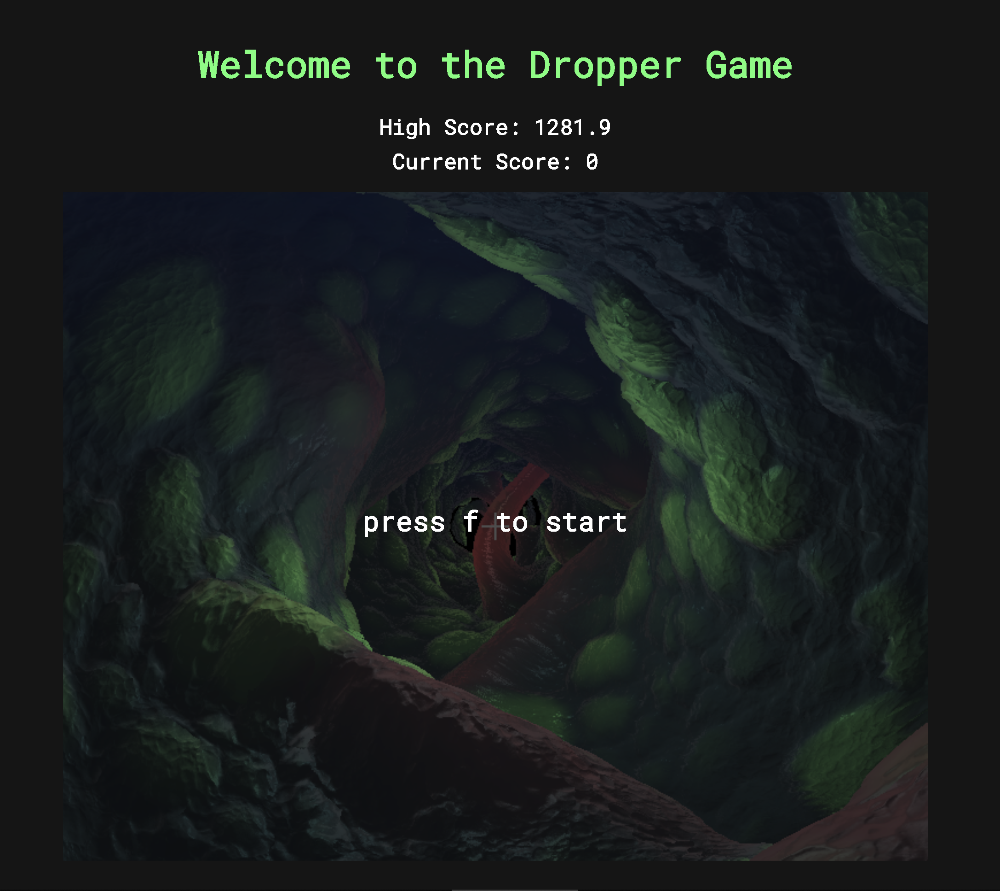

# Dropper Game

Demo Link: https://helenl9098.github.io/Dropper/

## Implementation Details

- You can select one of the three maps on the upper right corner. All the maps are rendered on a flat shader, whose fragments are colored using raymarching. By changing the map type, you are changing the signed distance function / ray marching equation used to color the flat shader.

- Map #1 (Rings) is created using torus-shaped SDFs repeated "at no cost" using the mod function. The path the rings take is a sin curve modified over time by other trig functions. The torus themselves shift in shape, with the x and y values deforming over a trig function of time. There is also a black vignette that helps fade out the geometry around the corners. The color of the rings is changed as the red, green, and blue components flucuate over time at different paces.

- Map #2 (Cube) is created using an inverted cylinder SDF that is masked using flooring functions to create a minecraft-like tunnel. The path the cylinder takes is also a sin curve modified over time by other trig functions. The colors of the tunnel are pink, with green rings that move through the tunnel as a function of time. The Tunnel has a glowing effect, which is calculated using the distance of the SDF to the eye. 

- Map #3 (Corridor) is created by twisting two planes together to give the illusion of a tunnel. From either plane, columns extend outwards as a function of time, which are then smooth blended together to form the gooey tentacles you see. The coloring is based off of the y values of the planes. As the arms extend inwards and converge at a y value of 0, the color transitions to pink. The farther away the two planes are, the bluer it is. The texture of the corridor is produced using a bump map and a height map that both use the same image. The lighter the texture image, the more extruded the plane is at that point. The bump map gives the smaller details by sampling the image at a smaller level and offseting the height of the surface ever so slighting. You can change the inputted image on the top right hand corner. 

- All the maps calculate a distance fog that hides the geometry in the distance to reduce visual clutter. 

- The player is first-person and moves up/right/down/left using WASD respectively. This is done by actually shifting the SDFs, instead of the moving the camera. The player falls down continuously as the SDFs move continously in the Z direction over time. The player falls down at an increasing velocity that caps at a terminal velocity depending on the difficulty level. The difficulty level also alters the speed at which velocity increases. 

- You start the game by pressing f. Any changes, like map type, difficulty, texture input, etc. will restart the game by resetting the variables. 

- Intersection is calculated on the GPU when the distance between the signed distance function and the eye is less than a certain epsilon. When the eye intersects the geometry, the screen turns blue. This information is rendered then passed back to the CPU using a framebuffer. If intersected, the CPU will reset the time and position. After this check, the data is finally rendered on to the canvas for the player to see. You can turn off intersection testing on the upper right hand corner, though the blue screens will still remain, indicating that you're inside the geometry.

- The score is calculated from the amount of time passed before intersecting. The game keeps track of the highest score for each map, even if you switch back and forth between them (assuming you don't restart the client). The current score reflects the score of the current run you are playing. If the current score is higher than the high score for that map, the high score will automatically update with the current score. When you intersect something and the game restarts, the current score goes back to 0. 

- The title, score, and instruction is displayed, styled, and positioned using html, css, and javascript. 

## Modifiable Features

- __Map__: select between Rings, Cube, and Corridor. Default is Corridor.

- __Difficulty__: select the difficulty at which you want to play the selected map at

- __Corridor texture__: alter the texture of the corridor map... go for something organic like pebbles (default) or something patterned like tiles!

- __Intersection__: default is to have intersection turned on! Intersection can be turned off for visual / debugging purposes.

## A few known bugs

- For the rings map, if there is an fps spike and you are moving too quickly, there is a chance you can "teleport" through the geometry without intersecting it. 
- For the cube map, if you turn the corner too sharply, the wall hits your eye from the left/right side. But since it is parallel to you, it is difficult to see how you could have intersected something.
- If you select a corridor texture and do not click back into the game window, pressing 's' will select the 'scale', 'sharp', or 'spiral' option instead of moving in the s direction.

## Resources

- https://www.shadertoy.com/view/MscBRs
- https://www.shadertoy.com/view/XstfzB
- https://webglfundamentals.org/webgl/lessons/webgl-render-to-texture.html
- https://tobiasahlin.com/moving-letters/
- https://stackoverflow.com/questions/11660710/css-transition-fade-in
- https://www.beacontechnologies.com/blog/2015/07/center-an-absolute-positioned-div/
- https://www.iquilezles.org/www/articles/distfunctions/distfunctions.htm
- https://www.shadertoy.com/view/Xds3zN
- https://www.shadertoy.com/view/XlXXWj
- http://jamie-wong.com/2016/07/15/ray-marching-signed-distance-functions/
- https://github.com/CIS-566-2019/textured-flame
- https://fonts.google.com/specimen/Roboto+Mono

